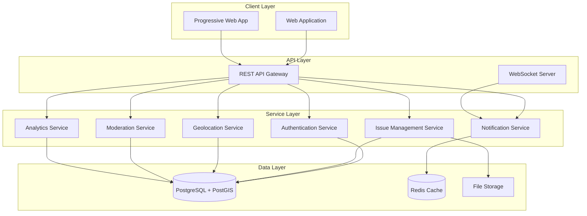

# CivicTrack Design Document

## Overview

CivicTrack is a location-based civic issue reporting platform built as a web application with mobile-responsive design. The system uses a modern web stack with real-time capabilities for notifications and status updates. The architecture emphasizes geospatial functionality, user privacy, and scalable content moderation.

## Architecture

### High-Level Architecture



### Technology Stack

**Frontend:**
- React.js with JavaScript
- Leaflet.js for interactive mapping
- Progressive Web App (PWA) capabilities for mobile experience
- Tailwind CSS for responsive design

**Backend:**
- Node.js with Express.js framework
- JavaScript (ES6+)
- Socket.io for real-time notifications
- JWT for authentication

**Database:**
- PostgreSQL with PostGIS extension for geospatial queries
- Redis for session management and caching

**Infrastructure:**
- File storage for image uploads (AWS S3 or similar)
- CDN for image delivery optimization

## Components and Interfaces

### Core Components

#### 1. Authentication System
- **Anonymous Users**: Can create reports without registration
- **Verified Users**: Email-verified accounts with enhanced privileges
- **Civic Authorities**: Special role for status updates
- **Administrators**: Full platform management access

#### 2. Issue Management System
- **Issue Creation**: Form-based reporting with photo upload
- **Issue Display**: Map-based and list-based views
- **Issue Filtering**: Multi-criteria filtering system
- **Status Tracking**: Workflow management with audit trail

#### 3. Geolocation System
- **Location Detection**: GPS-based with manual fallback
- **Proximity Filtering**: Radius-based issue visibility
- **Geofencing**: Automatic boundary enforcement
- **Location Validation**: Coordinate verification

#### 4. Moderation System
- **Flag Management**: User-driven content flagging
- **Auto-hiding**: Threshold-based automatic moderation
- **Admin Review**: Manual moderation interface
- **User Management**: Ban/unban functionality

#### 5. Notification System
- **Real-time Updates**: WebSocket-based notifications
- **Email Notifications**: Status change alerts
- **Push Notifications**: PWA-based mobile alerts

### API Interfaces

#### Issue Management API
```javascript
// Create Issue
POST /api/issues
{
  title: "string",
  description: "string", 
  category: "roads|lighting|water|cleanliness|safety|obstructions",
  location: { lat: 0.0, lng: 0.0 },
  photos: [], // File array
  isAnonymous: true|false
}

// Get Issues by Location
GET /api/issues?lat={lat}&lng={lng}&radius={radius}&status={status}&category={category}

// Update Issue Status (Authorities only)
PATCH /api/issues/{id}/status
{
  status: "reported|in_progress|resolved",
  comment: "string"
}

// Flag Issue
POST /api/issues/{id}/flag
{
  reason: "string"
}
```

#### Geolocation API
```javascript
// Validate Location Access
GET /api/geo/validate?lat={lat}&lng={lng}&targetLat={targetLat}&targetLng={targetLng}

// Get Nearby Issues
GET /api/geo/nearby?lat={lat}&lng={lng}&radius={radius}
```

#### Admin API
```javascript
// Get Flagged Issues
GET /api/admin/flagged-issues

// Review Flagged Issue
POST /api/admin/flagged-issues/{id}/review
{
  action: "approve|reject|delete",
  reason: "string"
}

// Get Analytics
GET /api/admin/analytics?startDate={date}&endDate={date}

// Manage Users
POST /api/admin/users/{id}/ban
```

## Data Models

### Core Entities

#### User Model
```javascript
// User object structure
const User = {
  id: "string",
  email: "string", // null for anonymous users
  isVerified: true|false,
  role: "citizen|authority|admin",
  isBanned: true|false,
  createdAt: new Date(),
  lastActiveAt: new Date()
}
```

#### Issue Model
```javascript
// Issue object structure
const Issue = {
  id: "string",
  title: "string",
  description: "string",
  category: "roads|lighting|water|cleanliness|safety|obstructions",
  status: "reported|in_progress|resolved",
  location: {
    lat: 0.0,
    lng: 0.0,
    address: "string" // optional
  },
  photos: [], // Array of URLs to stored images
  reporterId: "string", // null for anonymous reports
  isAnonymous: true|false,
  isHidden: true|false,
  flagCount: 0,
  createdAt: new Date(),
  updatedAt: new Date()
}
```

#### Status History Model
```javascript
// StatusHistory object structure
const StatusHistory = {
  id: "string",
  issueId: "string",
  previousStatus: "string",
  newStatus: "string",
  comment: "string",
  updatedBy: "string", // User ID
  updatedAt: new Date()
}
```

#### Flag Model
```javascript
// Flag object structure
const Flag = {
  id: "string",
  issueId: "string",
  flaggedBy: "string", // User ID
  reason: "string",
  createdAt: new Date(),
  reviewedAt: new Date(), // optional
  reviewedBy: "string", // optional
  reviewAction: "approved|rejected" // optional
}
```

### Database Schema Design

#### Geospatial Considerations
- Use PostGIS for efficient geospatial queries
- Create spatial index on issue locations
- Implement distance-based queries using ST_DWithin
- Store coordinates in WGS84 (SRID 4326)

#### Performance Optimizations
- Index on issue status and category for filtering
- Composite index on (location, status, category) for map queries
- Separate table for issue photos to optimize main queries
- Cache frequently accessed data in Redis

## Error Handling

### Client-Side Error Handling
- **Network Errors**: Retry mechanism with exponential backoff
- **Geolocation Errors**: Graceful fallback to manual location entry
- **Upload Errors**: Progress indication and retry options
- **Validation Errors**: Real-time form validation with clear messaging

### Server-Side Error Handling
- **Authentication Errors**: Clear 401/403 responses with redirect logic
- **Geolocation Errors**: Validation of coordinates and radius limits
- **File Upload Errors**: Size and type validation with detailed messages
- **Database Errors**: Transaction rollback and data consistency checks

### Error Response Format
```javascript
// Error response structure
const ErrorResponse = {
  error: {
    code: "string",
    message: "string",
    details: {}, // optional
    timestamp: "string"
  }
}
```

## Testing Strategy

### Unit Testing
- **Service Layer**: Test business logic for issue management, geolocation, and moderation
- **Utility Functions**: Test geospatial calculations and validation functions
- **API Endpoints**: Test request/response handling and error cases
- **Database Models**: Test data validation and relationships

### Integration Testing
- **API Integration**: Test complete request flows from client to database
- **Geolocation Integration**: Test location-based filtering and access control
- **File Upload Integration**: Test image upload and storage workflows
- **Notification Integration**: Test real-time notification delivery

### End-to-End Testing
- **Issue Reporting Flow**: Complete user journey from report creation to status updates
- **Moderation Flow**: Flag submission to admin review and resolution
- **Map Interaction**: Location-based filtering and issue discovery
- **Authentication Flow**: Anonymous and verified user experiences

### Performance Testing
- **Geospatial Queries**: Test performance with large datasets and concurrent users
- **File Upload**: Test multiple simultaneous image uploads
- **Real-time Notifications**: Test WebSocket performance under load
- **Map Rendering**: Test map performance with many issue pins

### Security Testing
- **Location Access Control**: Verify users cannot access issues outside their zone
- **File Upload Security**: Test for malicious file uploads and size limits
- **Authentication Security**: Test JWT handling and session management
- **Input Validation**: Test for SQL injection and XSS vulnerabilities

### Test Data Strategy
- **Geospatial Test Data**: Create test issues across different locations and distances
- **User Roles**: Test data for citizens, authorities, and administrators
- **Issue States**: Test data covering all status transitions and edge cases
- **Moderation Scenarios**: Test data for flagging and review workflows